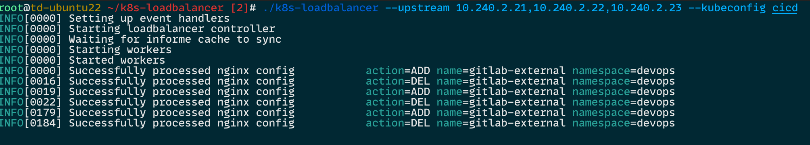

## 介绍

- 该程序会监控所有的 k8s service. 如果 k8s service 的类型是 `LoadBalancer` 并且有指定 annotations: `loadbalancer=enabled`, 就会自动为该 k8s service 创建一个 nginx 虚拟主机. nginx 的监听端口为 `service.spec.ports.port`, upstream 端口为 `service.spec.ports.NodePort`.
- 因为有多个 k8s service 使用同一个 LoadBalancer, 所以 nginx 的舰艇端口很容易重复, 如果不想使用默认的监控端口, 只需要为该 k8s service 增加 annotation: `nginx-listen-port=8080` 来改成指定的 nginx 监听端口.

- `--upstream` 用来指定上游主机的 ip 地址或主机名(需要确保你的 loadbalancer 能解析), 上游主机是安装了 kube-proxy 的 k8s 节点的 ip 地址. 你一定要确保上游主机一定允许 LoadBalancer 访问.
- `--kubeconfig` 用来指定你的 kubeconfig 文件, 如果不指定, 默认就是 $HOME/.kube/config 文件.

## 使用

直接运行.

`go run . --upstream 10.250.16.21,10.250.16.22,10.250.16.23`

`go run . --upstream 10.250.16.21,10.250.16.22,10.250.16.23 --kubeconfig youConfig`

`go run . --upstream 10.250.16.21,10.250.16.22,10.250.16.23 --kubeconfig yourConfig --log-level debug`

或者编译运行

```
go build -o k8s-loadbalancer .
./k8s-loadbalancer --upstream 10.250.16.21,10.250.16.22,10.250.16.23 --kubeconfig youConfig
```

## 安装

```
make install
```

## 卸载

```
make uninstall
```

## 截图


