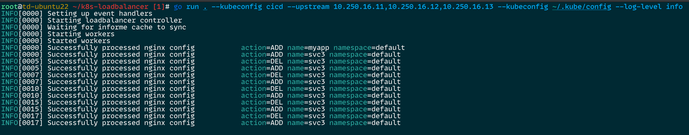

## 介绍

- 通过 informer list-and-watch 所有的 k8s service. 如果 k8s service 的类型是 `LoadBalancer` 并且有指定 annotation: `loadbalancer=enabled`, controller 会自动为该 k8s service 创建一个 nginx 虚拟主机. nginx 的监听端口为 `service.spec.ports.port`, upstream 端口为 `service.spec.ports.NodePort`.
- 因为有多个 k8s service 使用同一个 LoadBalancer, 所以 nginx 的监听端口很容易重复, 如果不想使用默认的监控端口, 只需要为该 k8s service 增加 annotation: `nginx-listen-port=8080` 来改成指定的 nginx 监听端口.

- `--upstream` 用来指定上游主机的 ip 地址或主机名(需要确保你的 LoadBalancer 能解析), 上游主机是安装了 kube-proxy 的 k8s 节点. 你要确保上游主机可以被该 LoadBalancer 访问.
- `--kubeconfig` 用来指定你的 kubeconfig 文件, 如果不指定, 默认就是 $HOME/.kube/config 文件.

## TODO

- [ ] 增加 --enable-firewall, 是否为 LoadBalancer 配置防火墙.
- [ ] 支持多系统, 目前主要支持 debian/ubuntu, centos/rocky 支持还不完善
- [ ] 增加更多的 debug 日志.
- [ ] 支持通过配置文件来为 k8s service 创建 nginx 虚拟主机, 在配置指定的 k8s service, 则不再检查 annotation, 但是还是会检查 service type 是不是 LoadBalancer 类型.
- [ ] nginx 延迟 reload, 如果短时间内修改了多个 nginx 配置需要 reload, 不需要频繁 reload nginx, 在指定时间范围内的多次 nginx 配置修改, 只需要 reload nginx 一次就行了.

## 使用

直接运行.

```bash
go run . --upstream 10.250.16.21,10.250.16.22,10.250.16.23
```

指定 kubeconfig

```bash
go run . --upstream 10.250.16.21,10.250.16.22,10.250.16.23 --kubeconfig youConfig
```

指定日志级别

```bash
go run . --upstream 10.250.16.21,10.250.16.22,10.250.16.23 --kubeconfig yourConfig --log-level debug
```

或者编译运行

```bash
go build -o k8s-loadbalancer .
./k8s-loadbalancer --upstream 10.250.16.21,10.250.16.22,10.250.16.23 --kubeconfig youConfig
```

## 安装

```bash
make install
```

## 卸载

```bash
make uninstall
```

## 启用服务

```bash
systemctl enable --now k8s-loadbalancer
systemctl status k8s-loadbalancer
```

## 截图


